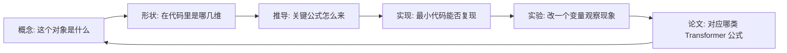

# 数学基础到 Transformer 研究

  

    
<strong>课程定位</strong>

    <h1 class="hero-title">从数学零散知识，到能读懂 Transformer 论文</h1>
    
这套课程不是按考试大纲组织，而是按深度学习研究中最常遇到的障碍组织：符号看不懂、矩阵形状接不上、概率直觉不稳定、梯度推导不会写、论文公式无法落到代码。

  

  

    <strong>最适合的学习者</strong>
    
会写一点 Python，知道神经网络训练的大概流程，但数学基础不系统，读 Transformer、Attention、归一化、位置编码、优化论文时经常卡住。

    <strong>第一版目标</strong>
    
先把每个主题讲成“能入门、能推导、能写代码验证”的课程讲义，再逐步扩展成完整教材。

  

## 如果你基础薄弱，先按这条线走

不要一上来读 SVD、矩阵微分或 FlashAttention。很多卡点其实不是高级数学，而是基础对象没有对齐：

- 不知道 \(x_i\)、\(x^{(i)}\)、\(X_{ij}\) 分别表示什么。
- 看不出向量、矩阵、张量在代码里对应哪一维。
- 只会背导数公式，不知道导数是“局部变化率”。
- 会调用 `torch.matmul`，但不知道矩阵乘法在做“加权求和”。
- 会写 `softmax`，但不知道为什么大 logits 会让概率饱和。

推荐从下面 5 个入口开始：

| 顺序 | 页面 | 你要解决的问题 |
|---:|---|---|
| 1 | 数学语言与符号 | 看公式时先识别对象、索引、求和、形状 |
| 2 | 函数、图像与变化率 | 理解函数、指数对数、斜率、导数和链式法则 |
| 3 | Python/NumPy/PyTorch 最小直觉 | 把公式中的向量、矩阵、张量对应到代码 |
| 4 | 线性代数 | 理解 embedding、线性层、attention logits 的矩阵计算 |
| 5 | 概率统计 | 理解 softmax、交叉熵、随机梯度和 attention 缩放 |

学完这 5 个入口，再进入张量运算、矩阵微分和 Transformer 数学，会少走很多弯路。

## 课程的核心学习闭环

每个主题都按同一个闭环学习：

这个闭环比单纯“读更多内容”更重要。数学学习最常见的问题是：读的时候觉得懂，写代码时发现 shape 不对，读论文时又不知道公式想解决什么问题。本课程会反复要求你写变量形状、跑最小代码、记录实验现象。

## 四层路线图

### 第 1 层：基础语言层

目标是把数学符号变成可读对象，而不是记忆定义。

| 主题 | 最小掌握标准 |
|---|---|
| 符号与索引 | 能解释 \(x_i\)、\(X_{ij}\)、\(\sum_i x_i\)、\(\mathbb{E}[X]\) |
| 函数与图像 | 能画出线性、二次、指数、对数、sigmoid、softmax 的直觉图 |
| 代码张量 | 能说清 `B, T, D, H` 分别代表 batch、序列、特征、head |

### 第 2 层：数学基础层

目标是把 Transformer 中反复出现的数学对象学扎实。

| 主题 | 对应模型对象 |
|---|---|
| 线性代数 | embedding、线性层、Q/K/V 投影、低秩压缩 |
| 张量运算 | batch 计算、多头拆分、einsum、广播 |
| 概率统计 | softmax、采样、方差、mini-batch 噪声 |
| 信息论 | 交叉熵、KL、困惑度、表示压缩 |
| 优化 | 梯度下降、Adam、学习率、数值稳定 |
| 矩阵微分 | attention 反传、LayerNorm 反传、残差梯度 |

### 第 3 层：Transformer 数学层

目标是能把论文公式还原为代码模块。

| 主题 | 你应该能回答 |
|---|---|
| Attention | \(QK^\top/\sqrt{d_k}\) 的 shape、方差和 softmax 维度是什么 |
| 多头注意力 | 多头是并行子空间还是简单重复，head 维怎么变化 |
| 位置编码 | 绝对位置、RoPE、ALiBi 分别把位置信息加在哪里 |
| 残差与归一化 | Pre-LN 为什么更利于深层训练 |
| 反向传播 | \(Q,K,V\) 的梯度如何从输出传回 |
| 高效 Attention | 近似、分块、IO 优化分别改变什么成本 |

### 第 4 层：研究强化层

目标从“看懂”转向“提出可验证的问题”。

| 方向 | 可做的小问题 |
|---|---|
| 长上下文 | 改变位置编码外推方式，固定其它变量做对比 |
| 机制解释 | 追踪某个 attention head 是否稳定承担同一功能 |
| 核方法与随机矩阵 | 用谱分布解释表示坍缩或低秩现象 |
| 结构改进实验 | 只改一处结构，控制参数量、数据、训练步数 |

## 每章怎么用

建议每章都产出四样东西：

| 产出 | 形式 | 例子 |
|---|---|---|
| 一页概念卡 | Markdown 表格 | “矩阵乘法 = 多个加权求和” |
| 一页推导 | 手写或 Markdown 公式 | 推导 attention 缩放因子 |
| 一段代码 | 20-40 行 notebook | 验证 logits 标准差随维度变化 |
| 一个小实验 | 表格或图 | 比较缩放前后 softmax 熵 |

如果某章只读不写，很快会忘；如果某章能写出这四样东西，就可以迁移到论文阅读和模型调试。

## 六个月最短路径

| 阶段 | 周数 | 学习重点 | 阶段产物 |
|---|---:|---|---|
| 0 | 第 0 周 | 数学符号、代码环境、笔记模板 | 建好 notebook 与学习日志 |
| 1 | 第 1-4 周 | 函数、线代、张量 | 写出 embedding 到 attention logits 的 shape 流 |
| 2 | 第 5-8 周 | 概率、信息论、softmax | 实现稳定 softmax、cross entropy、KL |
| 3 | 第 9-13 周 | 优化、矩阵微分 | 手推线性层、attention、LayerNorm 梯度 |
| 4 | 第 14-20 周 | Attention、MHA、位置编码 | 从零写 mini attention block |
| 5 | 第 21-26 周 | 高效 attention、长上下文、实验设计 | 完成一篇 5-8 页技术报告 |

## 读论文时如何使用本站

遇到论文公式时，不要直接查“这个公式是什么意思”。按下面顺序拆：

1. 找出公式中的对象：标量、向量、矩阵还是张量。
2. 写出每个对象的 shape，例如 \(Q,K,V\in\mathbb{R}^{B\times H\times T\times d_h}\)。
3. 判断每一步操作：线性变换、归一化、softmax、采样、近似、分块还是缓存。
4. 回到本站对应章节补概念，例如 shape 卡住就看张量运算，梯度卡住就看矩阵微分。
5. 写 20 行以内代码复现公式的输入输出。
6. 问它解决什么问题：稳定性、表达能力、速度、显存、长上下文还是可解释性。

## 里程碑

| 里程碑 | 完成标准 |
|---|---|
| M1 基础可读 | 能独立解释一页 Transformer 论文中的符号和 shape |
| M2 线代可用 | 能说明线性层、投影、低秩近似和 SVD 的关系 |
| M3 概率可用 | 能推导 \(1/\sqrt{d_k}\) 缩放，并解释 softmax 饱和 |
| M4 实现可用 | 能从零写 attention logits、mask、softmax、weighted sum |
| M5 反传可用 | 能推导 \(Y=XW\)、\(S=QK^\top\)、\(O=PV\) 的梯度 |
| M6 研究可用 | 能设计一个只改变单一变量的 controlled ablation |

## 最小学习要求

- 每天至少写一个变量 shape。
- 每周至少手推一个公式。
- 每周至少跑一个最小代码实验。
- 每两周选择一篇论文，把公式映射到本站章节。
- 每月整理一次“我仍然不懂的概念”，回到基础页补齐。

本站的目标不是让你一次性掌握所有数学，而是让每个数学概念都能落到 Transformer 的真实张量、代码和实验问题上。
