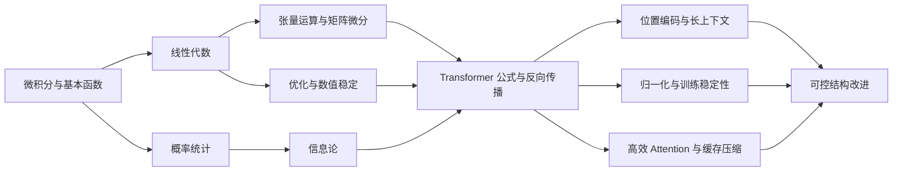

# 数学基础到 Transformer 研究

<div class="hero">
  <div>
    <p><strong>课程定位</strong></p>
    <h1 class="hero-title">从矩阵、概率、梯度到 Transformer 结构改进</h1>
    <p>这是一套面向深度学习研究的数学课程。它不以考试为目标，而以读懂 Transformer 论文、诊断训练现象、设计可控结构实验为目标。</p>
  </div>
  <div class="hero-card">
    <strong>适合谁</strong>
    <p>会写 Python，了解深度学习基本流程，但数学没有系统化，读论文时经常被公式、形状、梯度和稳定性卡住的人。</p>
    <strong>学完能做什么</strong>
    <p>从零写 attention 小模块，解释 logits 缩放、LayerNorm、位置编码和高效 attention 的数学动机，并能设计 controlled ablation。</p>
  </div>
</div>

## 为什么要单独学“面向 Transformer 的数学”

通用数学教材通常按学科逻辑展开：线性代数讲向量空间，概率论讲随机变量，优化讲凸性和收敛。但 Transformer 研究中的问题是交叉的：一个 attention block 同时涉及矩阵乘法、概率归一化、信息路由、数值稳定、梯度传播和显存访问。若只按传统课程孤立学习，很容易出现“每门课都懂一点，但论文里的公式仍然串不起来”的问题。

本课程把数学对象重新组织为四条线：

1. **表示线**：向量、矩阵、张量、子空间、低秩和谱。
2. **概率线**：方差、协方差、softmax、交叉熵、KL 和随机梯度。
3. **优化线**：Taylor、Jacobian、条件数、Adam、归一化和训练稳定性。
4. **研究线**：位置外推、高效 attention、机制解释、长上下文和结构改进。

## 学习主线



一句话版本：先把“矩阵、概率、梯度”打扎实，再用“谱、核、信息、极限”去分析 Transformer 的改进方向。

## 课程结构

<div class="course-grid">
  <div class="course-card"><strong>入门</strong>学习方法、推导笔记和实验日志。建立概念-推导-实现-实验闭环。</div>
  <div class="course-card"><strong>数学基础</strong>微积分、线代、张量、概率、信息论、优化、矩阵微分。</div>
  <div class="course-card"><strong>Transformer 数学</strong>attention、MHA、位置编码、残差归一化、反向传播、高效 attention。</div>
  <div class="course-card"><strong>研究强化</strong>分析与泛函、核方法、随机矩阵、机制解释、长上下文、结构改进实验。</div>
</div>

## 每章怎么学

| 模块 | 作用 | 最终产出 |
|---|---|---|
| 学习目标 | 明确本章能力边界 | 能说清学完能做什么 |
| 为什么要学 | 把数学对象连接到 Transformer | 能解释它对应哪个模型对象 |
| 核心概念 | 给出最低必要概念 | 概念卡片 |
| 关键公式 | 选出值得手推的式子 | 一页推导 |
| 对应关系 | 连接模型、训练和论文 | 概念到结构映射表 |
| 代码块 | 用最小实现验证直觉 | 可运行 notebook 片段 |
| 练习与产出 | 固化能力 | 图、表、代码或报告 |

## 六个月最短路径

| 阶段 | 周数 | 主题 | 阶段产物 |
|---|---:|---|---|
| 0 | 第 0 周 | 环境与学习日志 | 笔记模板、代码目录、复盘机制 |
| 1 | 第 1-6 周 | 线性代数与张量 | 低秩近似实验、einsum attention logits |
| 2 | 第 7-12 周 | 概率统计与信息论 | 稳定 softmax、交叉熵、KL 实现 |
| 3 | 第 13-17 周 | 微分与优化 | LayerNorm/attention 反传推导 |
| 4 | 第 18-26 周 | Transformer 数学 | mini Transformer block 和技术报告 |

## 一年研究强化路径

第 27 周之后，学习重心从“看懂公式”转向“提出和验证假设”。你需要学习分析与泛函入口、核方法、随机矩阵、机制解释和长上下文系统，然后选一个足够小的问题做 controlled ablation。好的问题通常不是“我要发明新架构”，而是“我能否用一个数学动机明确、变量可控的改动改善某个指标”。

## 关键里程碑

| 里程碑 | 完成标准 |
|---|---|
| M1 线代可用 | 能解释为什么 SVD 支持低秩 attention 和 KV cache 压缩 |
| M2 概率可用 | 能推导 \(q^\top k\) 方差为什么随 \(d_k\) 增长 |
| M3 数值稳定可用 | 能实现稳定 softmax / log-sum-exp / cross entropy |
| M4 反传可用 | 能手推 \(Q,K,V\) 和 LayerNorm 的梯度 |
| M5 Transformer 可用 | 能从零写 attention、MHA、FFN、残差、LayerNorm |
| M6 论文可用 | 能读 RoPE、ALiBi、FlashAttention、Pre-LN/DeepNorm 的核心公式 |
| M7 研究可用 | 能设计一个局部改动，并做 controlled ablation |

## 推荐使用方式

不要从头到尾只读网页。每一章都要配合一个 notebook 或脚本完成。建议每周固定提交三类产物：一页概念笔记、一页推导、一段最小代码。若某章读完没有任何可运行结果，说明它还没有转化为研究能力。

## 长章学习指南

这一页不要按普通博客的方式快速扫过。建议按三轮阅读完成：第一轮只看标题、表格和公式，建立全局地图；第二轮逐段补齐变量形状和直觉；第三轮把代码复制到 notebook 中运行，记录输出和异常。完成三轮后，再回到“检查问题”部分逐条回答。

### 第一轮：建立对象地图

| 问题 | 记录方式 |
|---|---|
| 本章研究的对象是什么 | 写出 3 个关键词 |
| 对象在 Transformer 中对应哪个模块 | 标出 attention、FFN、LN、位置编码或训练环节 |
| 本章最核心的公式是什么 | 抄写公式并标注变量形状 |
| 最小代码验证什么 | 写出输入、输出和期望现象 |

### 第二轮：补齐推导链

阅读公式时，按下面顺序补齐中间步骤：

1. 写出所有变量的形状。
2. 标出每一步是线性、非线性、归一化、近似还是采样。
3. 写出这一步是否改变均值、方差、范数、秩或熵。
4. 说明这一步是否影响梯度传播。
5. 判断它是否引入额外计算、显存或延迟。

这五步会把 数学基础到 Transformer 研究 从抽象概念变成可检查的模型行为。

### 第三轮：运行最小代码

代码练习不要求一开始就工程化。最小版本只需要满足：

- 输入是随机张量或一个小 toy 数据。
- 输出能验证本章某个公式或直觉。
- 打印 shape、均值、方差、范数或误差。
- 改一个变量后能观察变化。

如果代码不能解释一个数学问题，它只是示例；如果代码能支持或反驳一个假设，它才是实验。

## 分层掌握标准

| 层级 | 能力表现 | 自测问题 |
|---|---|---|
| 入门 | 能复述定义和用途 | 这个概念解决什么问题？ |
| 可用 | 能写出公式和 shape | 变量维度是否全部明确？ |
| 可实现 | 能写最小代码 | 输出是否符合公式预期？ |
| 可诊断 | 能解释异常现象 | 数值、梯度或 shape 哪里可能错？ |
| 可研究 | 能设计 controlled ablation | 哪个变量被改变，哪个变量被固定？ |

学习 数学基础到 Transformer 研究 时，至少达到“可实现”层级再进入下一章。若目标是论文研究，需要达到“可诊断”或“可研究”。

## 典型调试清单

当你在本章相关代码中遇到问题，优先检查下面几项：

1. **shape 是否符合公式**：尤其是 batch、head、sequence、feature 轴。
2. **数值尺度是否异常**：均值、方差、最大值、最小值是否合理。
3. **softmax 或归一化是否在正确维度**。
4. **mask 是否广播到正确位置**。
5. **梯度是否存在 NaN、Inf 或突然变为 0**。
6. **实验是否固定随机种子和关键超参**。
7. **比较方法是否参数量、训练步数和数据一致**。

## 笔记模板

复制下面模板到你的 Obsidian 或 notebook：

```markdown
# 数学基础到 Transformer 研究 学习笔记

## 一句话直觉

## 核心对象与形状

| 对象 | 形状 | 含义 |
|---|---|---|

## 关键公式

## 推导步骤

## 最小代码输出

## 常见错误

## 与 Transformer 的关系

## 本章实验结论
```

## 进阶练习

- 把本章公式改写成带 batch 和 head 维度的版本。
- 找一个相关论文公式，标注它依赖本章哪些概念。
- 用随机输入构造一个失败案例，并解释失败原因。
- 把最小代码改成函数，并写 2 个断言检查 shape 和数值范围。
- 设计一个只改变一个变量的小实验，并记录结果。

## 与其它章节的连接

数学基础到 Transformer 研究 不是孤立章节。你应该主动回看这些关系：

| 连接方向 | 需要回看的内容 |
|---|---|
| 数学对象 | 线性代数、概率统计、矩阵微分 |
| 实现对象 | 张量运算、Attention 形状流 |
| 训练对象 | 优化与数值稳定、残差与归一化 |
| 研究对象 | 高效 Attention、长上下文、结构改进实验 |

如果某个连接读不懂，不要继续堆新概念，回到对应基础页补齐。

## 复盘问题

完成本章后，用不超过 300 字回答：

1. 数学基础到 Transformer 研究 最重要的一个数学对象是什么？
2. 它在 Transformer 中对应哪个模块或现象？
3. 哪个公式最值得手推？
4. 哪段代码最能验证这个公式？
5. 如果实验失败，你会先排查 shape、数值、梯度还是数据？为什么？

## 本章完成标准

- 能把核心公式写在白纸上，不依赖网页。
- 能解释每个变量的形状和语义。
- 能运行最小代码并解释输出。
- 能指出一个常见误区和一个调试方法。
- 能把本章内容连接到至少一个 Transformer 研究问题。

