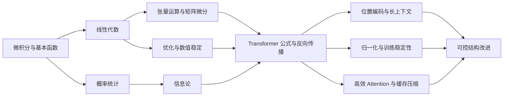

# 数学基础到 Transformer 研究

  

    
<strong>课程定位</strong>

    <h1 class="hero-title">从矩阵、概率、梯度到 Transformer 结构改进</h1>
    

      这不是一套面向考试的数学复习材料，而是一条面向深度学习研究的数学学习路线。
      目标是让学习者能从公式、代码和实验三层理解 Transformer，读懂位置编码、训练稳定性、
      高效 attention、长上下文和机制解释相关论文，并能设计小规模 controlled ablation。
    

  

  

    <strong>默认学习者</strong>
    
具备计算机或工程基础，会写 Python，但数学知识没有系统化。

    <strong>默认投入</strong>
    
每周 10 小时，先完成 6 个月最小研究能力，再进入 12 个月研究强化。

    <strong>最终产物</strong>
    
一个可运行的 attention/Transformer 小项目，一份技术报告，一组可复现实验表。

  

## 学习主线

一句话版本：先把“矩阵、概率、梯度”打扎实，再用“谱、核、信息、极限”去分析 Transformer 的改进方向。

## 课程结构

  

    <strong>入门</strong>
    如何学习数学、如何写推导笔记、如何把实验日志写成可复盘证据。
  

  

    <strong>数学基础</strong>
    微积分、线代、张量、概率、信息论、优化和矩阵微分。
  

  

    <strong>Transformer 数学</strong>
    attention、MHA、位置编码、残差归一化、反向传播和高效 attention。
  

  

    <strong>研究强化</strong>
    分析与泛函入口、核方法、随机矩阵、机制解释、长上下文和结构改进实验。
  

## 每章怎么学

每个主题页都按同一套结构组织：

| 模块 | 作用 |
|---|---|
| 学习目标 | 明确学完能解释什么、推导什么、实现什么 |
| 为什么要学 | 把数学对象连接到 Transformer 中的真实对象 |
| 核心概念 | 给出最低必要概念，不追求百科式铺开 |
| 关键公式 | 选出最值得手推和复现的公式 |
| Transformer 对应关系 | 说明该数学概念在 attention、FFN、LN、训练或长上下文中的位置 |
| 最小练习 | 用一页推导、一段代码或一个小实验验收 |
| 阶段产出 | 转化为笔记、图表、代码或实验表 |

## 最短可执行路线

1. 线性代数：矩阵乘法、秩、投影、特征分解、SVD。
2. 概率统计：随机变量、期望方差、多变量高斯、条件期望、LLN/CLT。
3. 信息论：熵、交叉熵、KL、softmax temperature。
4. 优化：梯度下降、SGD/Adam、L-smooth、数值稳定、log-sum-exp。
5. 矩阵微分：Jacobian、Hessian、链式法则、attention 反传。
6. Transformer：self-attention、multi-head、FFN、残差、LayerNorm、mask。
7. 改进入口：RoPE/ALiBi、Pre-LN/DeepNorm、FlashAttention、Performer/RetNet、Retrieval Heads。

